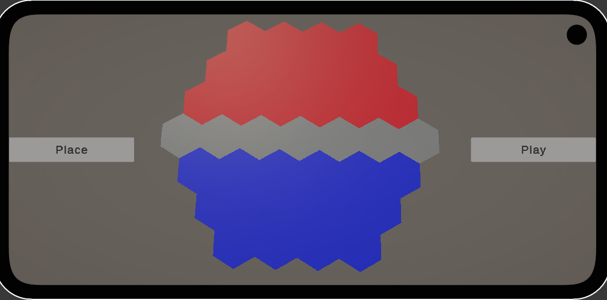
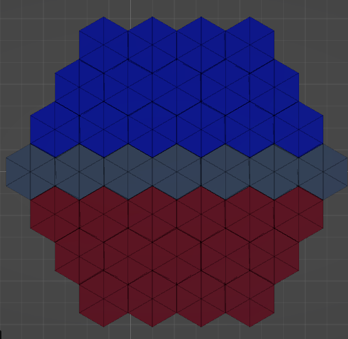
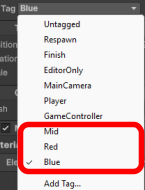
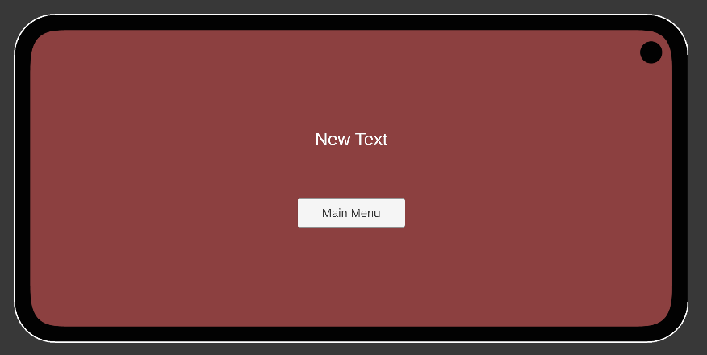

# AnukGuerra_ACT3_Projecte-AR

Projecte de realitat augmentada desenvolupat amb Unity i Vuforia.  
El joc consisteix en col·locar unitats sobre un tauler hexagonal utilitzant Image Targets i iniciar una partida per equips.

---

## 🟢 Escena 1: Menú

Canvas amb dos botons:

- **Play**: Canvia a l’escena de joc.
- **Exit**: Tanca l’aplicació.

---

## 🔵 Escena 2: Partida

### 🧩 Tauler
Objecte format per múltiples hexàgons, cadascun amb un `tag`:
- `red`
- `blue`
- `mid`

Aquests tags permeten col·locar les peces segons l’equip.

---

### 📍 Trackers

#### Center Image Target
Activa el tauler quan és detectat.

#### Unit Image Target
Activa un GameObject que serveix per col·locar les fitxes als hexàgons.

🔹 **Detall important**  
El `UnitPlacer` està lleugerament elevat per poder fer un **raycast cap avall** i detectar el tauler.  
Això permet que, encara que els trackers estiguin sobre una superfície plana, el sistema funcioni correctament.

---

### 🎮 UI

- **Botó Place**
  - Desactivat si:
    - No es detecten els targets del tauler i del personatge
    - El personatge no està en una casella vermella o blava

- **Botó Play**
  - Desactivat si:
    - No hi ha mínim una peça per equip
    - Els equips no tenen el mateix nombre de peces

  ✔️ Configuracions vàlides: `1v1`, `2v2`, `3v3`, etc.

---

### 🤖 Comportament dels Personatges

---

### ☠️ Mort dels Personatges

---

## 🏆 Escena 3: Victòria / Derrota

- **Imatge**: Canvia el color segons l’equip guanyador
- **Text**: Mostra el nom/color de l’equip guanyador
- **Botó**: Torna a l’escena del menú principal

